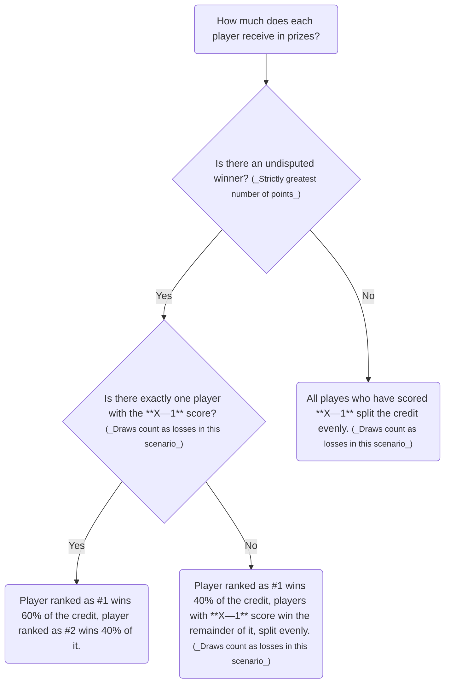

---

## Introduction

To avoid any unpleasantness related to potential ambiguities during Legacy League matches, the following rules have been written down and adopted for the zeroth season of the Legacy League.

Additionally, this article outlines the general way the League operates.

## Points

During Legacy FNMs organized by [CentrumMTG](https://www.centrum-mtg.com.pl/) (held on Wednesdays at 6:30 PM), every scored point counts toward the League ranking for the given season. Points are not carried over between seasons.

## Season

The first season starts with the publication of [Banned and Restricted Announcement on 30.06.2025](https://magic.wizards.com/en/news/announcements/banned-and-restricted-june-30-2025). The planned end of the season is November 19, 2025 (Wednesday). Points scored during the tournament held on that day are **included** in the season's results.

## FNMs

The final and sole source of information regarding points earned in a given FNM is the results panel from the _Companion_ app. This can only be changed upon agreement with the store organizing the FNM.

### Registration

A person is considered registered for the FNM once they enter the appropriate code in the _Companion_ app. In the case of being late to the tournament, the first priority is to locate your opponent and play the round, and only afterward to pay the entry fee at the store[^agreed-on].

[^agreed-on]: This solution has been discussed and approved by the FNM organizer.

### Tardiness

In the case of any player being late[^unless-bye] to the start of a round, if that player's match reaches the time in the round, the tardy player immediately loses the entire match. No "standard" extra turns are played.

The _start of the round_ is defined as the moment when the official timer is started.

[^unless-bye]: The exception is when the tardy player receives a bye. It is **not** a standard practice to intentionally assign a bye to a player who is late. In exceptional cases, the situation should be discussed with the players, and the round may be restarted (which implies changing the pairings).

### Pairings

Unless the store organizing the FNM introduces any changes, all pairings are distributed through the _Companion_ app and displayed on a screen in the play area.

> Since each round must be manually started by the tournament organizer, we kindly ask all players to report their results in the app immediately, and if you are the last pair still playing, to inform the organizer that the next round can be started.
{: .prompt-tip }

## Prizes

For every FNM and for certain achievements in this League season, the following prizes are distributed:

## Store credit 

For each FNM, _store credit_ is distributed among the top players. The majority of the winnings goes to the player that finished in the first place, while the remaining pool is shared among other players who scored at least $$ \mathbf{X}-1 $$. Draws are treated like losses, unless this concerns only the player who finished first without any tiebreakers. If such treatment demotes the top players who are tied in the first place, they are treated as if they scored $$ \mathbf{X}-1 $$[^ex1][^ex2][^ex3]. The following flowchart is a graphical representation of these rules:

## Mini-boosters 

For each FNM, the store may distribute mini-boosters, which are to be redrafted (draft order follows that FNM's standings).

## Final prizes

At the end of the season, the following prizes are awarded: **_TBD_**.

[^ex1]: _Example 1_: There is one player who scored $$ 4-0-0 $$ and three players who scored $$ 3-1-0 $$. The first player receives 40% of the prize pool and the three players who scored $$ 3-1-0 $$ each receive 20% ( $$ 40\% + 3 * 20\% = 100\% $$ ).

[^ex2]: _Example 2_: There is one player who scored $$ 3-0-1 $$ and three players who scored $$ 3-1-0 $$. Because there is an undisputed winner, the situation is exactly the same as in [^ex1].

[^ex3]: _Example 3_: There are two players who scored $$ 3-0-1 $$ and three players who scored $$ 3-1-0 $$. Because there is no definitive winner (ignoring the tiebreakers), the full prize pool is split evenly among those five players. 

---
